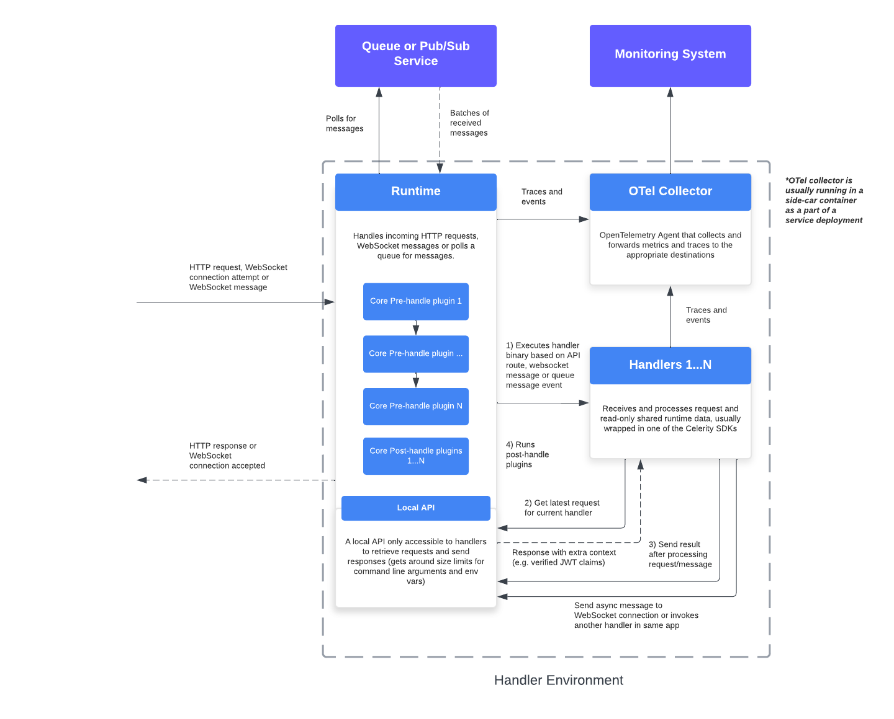
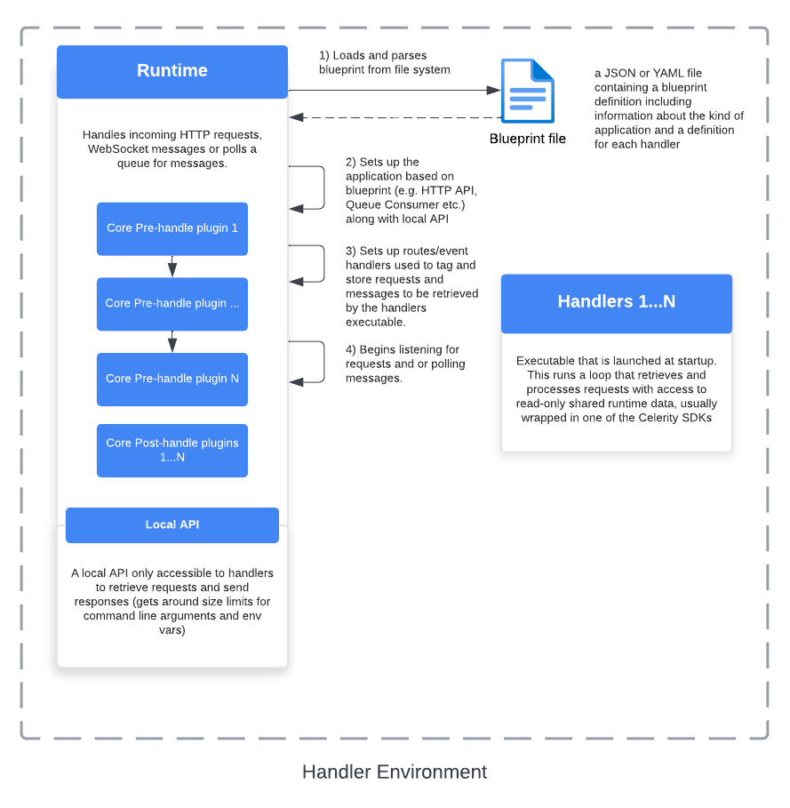
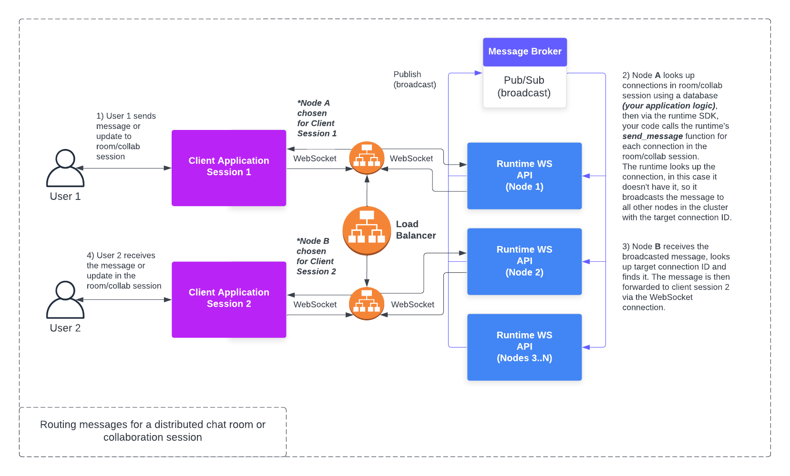

# Architecture Overview

The core runtime is an application that acts as a HTTP server, WebSocket server and a message queue consumer. It is responsible for processing incoming requests, messages/events, and routing them to the appropriate handlers defined by developers.

The core runtime is a Rust application that interacts with handlers via binary execution and API calls. This means that it doesn't matter what language the handlers are written in, as long as they can be executed and communicate with the local runtime API over HTTP.

The core runtime is best suited for applications where the handlers need to be written in a language that is compiled ahead of time, such as Rust, C, C++ or Go.

The core runtime has a plugin system that can be called at the "pre-handle" and "post-handle" stages of processing a request or message. This plugin system is meant to be lightweight and only deal with essential tasks such as authentication and handling CORS headers, the primary interaction developers using the runtime will have with this is configuration for CORS and auth in a blueprint definition for an application.
**_This is not interchangeable with the plugin systems defined for language-specific SDKs for handlers, all core runtime plugins must be written in Rust._**


## Run-time flow

The following diagram provides a relatively high level view of how it works at run-time on receiving a request or a batch of messages from a queue or similar:



## Startup process

The following diagram provides an overview of the process of starting up the core runtime:



## Run-time flow in AWS

The following diagram provides a look at how it works at run-time in an AWS environment:


This is high-level and doesn't cover the specifics of all the components involved in deploying the runtime in AWS such as ALBs, VPCs, etc.

## Horizontal scaling with WebSockets

For applications that require WebSockets, the core runtime can be horizontally scaled by using a technology such as Redis (or ValKey) pub/sub or stream pub/sub features to allow communication between nodes in a cluster where each node is an instance of the runtime.

On receiving a message to be sent to a specific connection, a node will look up the target connection ID locally to see if it has the connection, if it doesn't, it will then broadcast the message to all other nodes in the cluster. If another node has the connection, it will proceed to forward the message to the client over the WebSocket connection, all other nodes will ignore the message.

The runtime supports a serverless-like approach to sending messages to specific connections, where the runtime will handle the routing of messages to the correct node in the cluster.

Here is some Python pseudo-code to illustrate this for the purpose of relaying a message to all clients in a chat room:

```python
from celerity_runtime.wsconn import send_message

def handler(event, chat_room_service, context):
    room = event['room']
    message = event['message']
    connection_ids = chat_room_service.get_connections(room)
    for connection_id in connection_ids:
        send_message(connection_id, message)
```

This allows for implementing features such as chat rooms or real-time collaboration without having to worry about which node a connection is on.

The following diagram provides an overview of how this works:



## Local development

When working on applications that use the core runtime, you can invoke handlers directly without having to wire them up to a message queue or HTTP route. This is useful for testing and debugging, as well as for developing handlers in isolation.