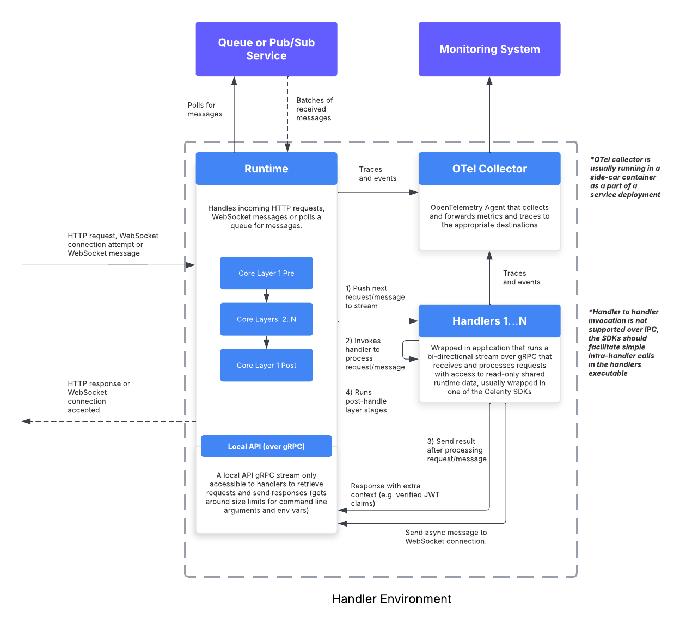
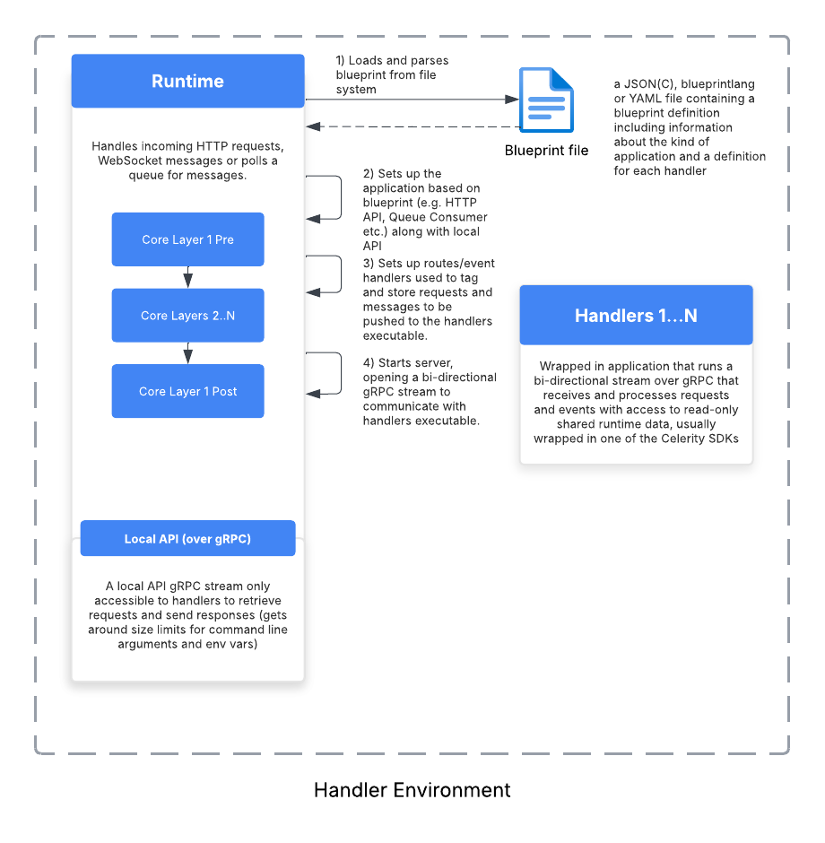
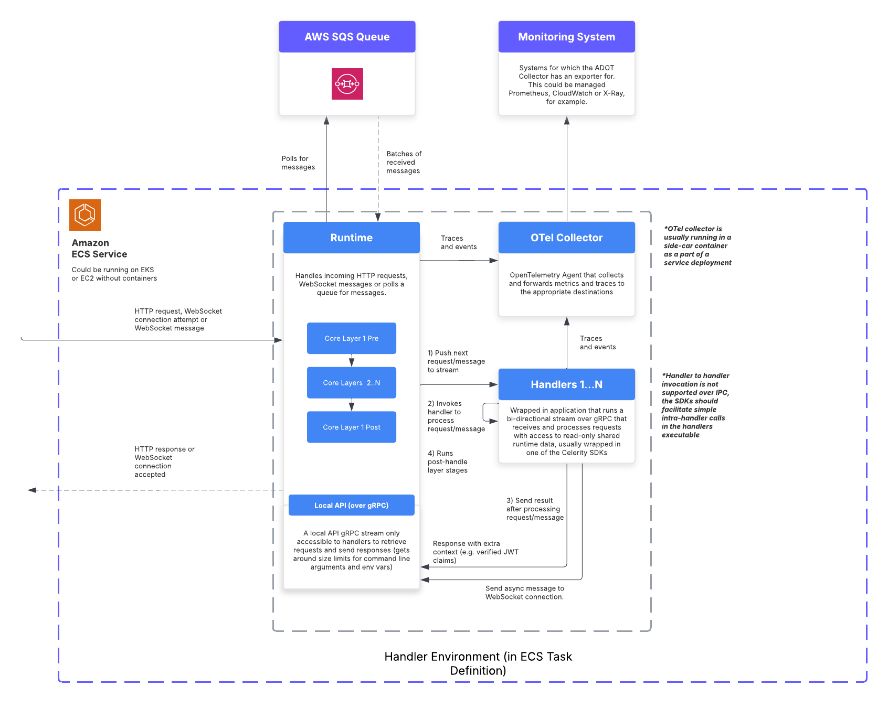
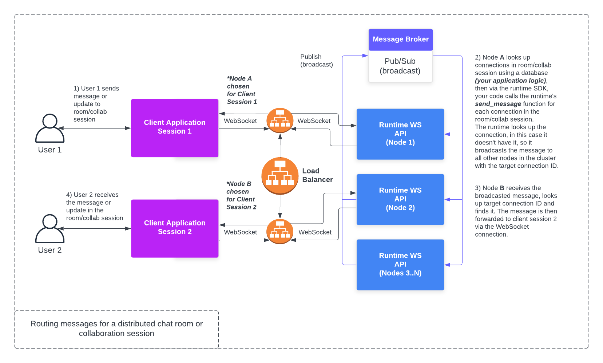

# Architecture Overview

The core runtime is an application that acts as a HTTP server, WebSocket server and a message queue consumer. It is responsible for processing incoming requests and messages/events; it then tags each one with the handler that is to run it and puts it on an in-memory queue, from which it is dispatched to the handlers executable that runs the handler developers defined.

The core runtime is a Rust application that interacts with handlers over the [Celerity IPC protocol](../../../libs/runtime/proto/README.md): one long-lived bidirectional gRPC stream over a unix socket, carrying events, results, configuration, WebSocket sends, cancellation and shutdown. This means that it doesn't matter what language the handlers are written in, as long as they can be executed and can speak the protocol, which a Celerity SDK for the language does on their behalf.

The stream is what makes this different from a polling API. The runtime does not dispatch until the handlers executable has declared what it serves and how much work it can take, it grants credit rather than letting work pile up on a process that cannot keep up, and it can cancel an event that has passed its deadline instead of waiting to find out.

When using the core runtime there are two processes that are started, the main runtime process and the process for your compiled binary that contains your application's handlers. The runtime starts the second itself, once the handler stream is bound, and the two share a lifetime: the runtime drains and stops the executable on shutdown, and stops itself if the executable exits while it is still serving.

The core runtime is best suited for applications where the handlers need to be written in a language that is compiled ahead of time, such as Rust, C, C++ or Go.

The core runtime processes a request or message through a stack of **layers**. Each layer wraps the one inside it: it runs whatever it needs to before calling `next`, and whatever it needs to after that call returns, so a single layer sees both the way in and the way out. The innermost `next` is the dispatch to the handlers executable.

Timing a request, adding a header to whatever response comes back, or turning a handler's error into a response body all need the same layer to see both sides. A layer can also decline to call `next` at all and return its own response, which is how authentication rejects a request before it reaches a handler, and how a cached response is served without one.

Layers run outermost first on the way in and unwind in the reverse order on the way out, so the order they are declared in is the order they see the request.

The layer system is meant to be lightweight and only deal with essential tasks such as authentication and handling CORS headers; the primary interaction developers using the runtime will have with it is configuration for CORS and auth in a blueprint definition for an application.
**_This is not interchangeable with the middleware systems defined for language-specific SDKs for handlers, all core runtime layers must be written in Rust._**


## Run-time flow

The following diagram provides a relatively high level view of how it works at run-time on receiving a request or a batch of messages from a queue or similar:



## Startup process

The following diagram provides an overview of the process of starting up the core runtime:



## Run-time flow in AWS

The following diagram provides a look at how it works at run-time in an AWS environment:



This is high-level and doesn't cover the specifics of all the components involved in deploying the runtime in AWS such as ALBs, VPCs, etc.

## Horizontal scaling with WebSockets

For applications that require WebSockets, the core runtime can be horizontally scaled by using a technology such as Redis (or ValKey) pub/sub or stream pub/sub features to allow communication between nodes in a cluster where each node is an instance of the runtime.

On receiving a message to be sent to a specific connection, a node will look up the target connection ID locally to see if it has the connection, if it doesn't, it will then broadcast the message to all other nodes in the cluster. If another node has the connection, it will proceed to forward the message to the client over the WebSocket connection, all other nodes will ignore the message.

The runtime supports a serverless-like approach to sending messages to specific connections, where the runtime will handle the routing of messages to the correct node in the cluster.

Here is some Go pseudo-code to illustrate this for the purpose of relaying a message to all clients in a chat room:

```go
func Handler(ctx context.Context, event ChatEvent, rooms ChatRoomService) error {
	connectionIDs, err := rooms.GetConnections(event.Room)
	if err != nil {
		return err
	}
	for _, connectionID := range connectionIDs {
		if err := wsconn.SendMessage(ctx, connectionID, event.Message); err != nil {
			return err
		}
	}
	return nil
}
```

This allows for implementing features such as chat rooms or real-time collaboration without having to worry about which node a connection is on.

The following diagram provides an overview of how this works:



## Local development

When working on applications that use the core runtime, you can invoke handlers directly without having to wire them up to a message queue or HTTP route. This is useful for testing and debugging, as well as for developing handlers in isolation.