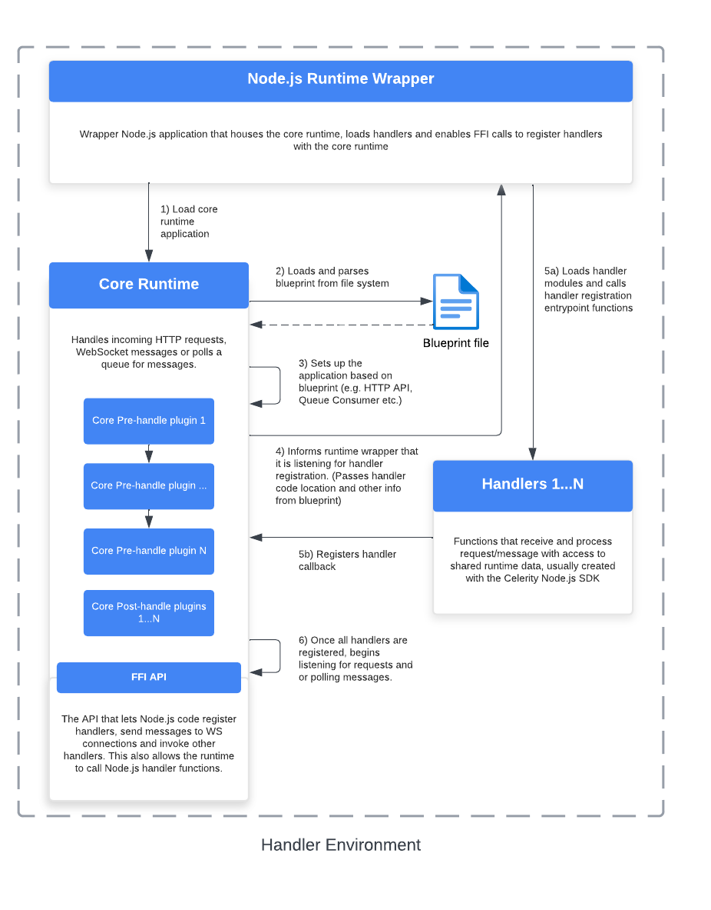
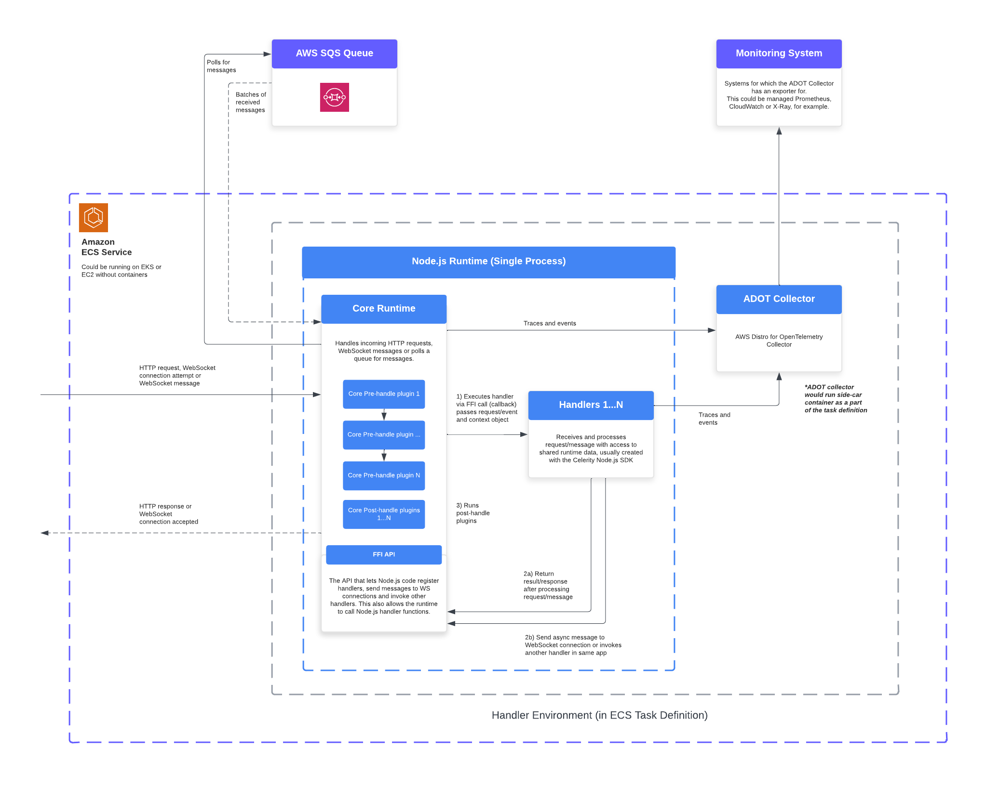

# Architecture Overview

The Node.js runtime is an application that acts as a HTTP server, WebSocket server and a message queue consumer. It is responsible for processing incoming requests, messages/events, and routing them to the appropriate handlers defined by developers.

The Node.js runtime is a Rust application that interacts with handlers via bi-directional FFI calls. The handler setup code calls into the runtime to register the handler functions and the runtime calls into the Node.js handler functions when an event, message or request is received. An API is exposed as part of the SDK that allows handlers to send asynchronous messages to WebSocket connections or invoke other handlers in the same app.

_FFI stands for [Foreign Function Interface](https://en.wikipedia.org/wiki/Foreign_function_interface)._

When the runtime launches, it parses a blueprint file that defines the handles and then waits for each handler to be registered. Once all handlers are registered, the runtime will start listening for incoming requests, messages and events.

The Node.js runtime has the same plugin system as all other runtimes that can be called at the "pre-handle" and "post-handle" stages of processing a request or message. This plugin system is meant to be lightweight and only deal with essential tasks such as authentication and handling CORS headers, the primary interaction developers using the runtime will have with this is configuration for CORS and auth in a blueprint definition for an application.
**_This is not interchangeable with the plugin systems defined for language-specific SDKs for handlers, all core runtime plugins must be written in Rust._**

## Run-time flow

The following diagram provides a relatively high level view of how it works at run-time on receiving a request or a batch of messages from a queue or similar:

## Startup process

The following diagram provides an overview of the process of starting up the Node.js runtime:

## Run-time flow in AWS

The following diagram provides a look at how it works at run-time in an AWS environment:

This is high-level and doesn't cover the specifics of all the components involved in deploying the runtime in AWS such as ALBs, VPCs, etc.

## Horizontal scaling with WebSockets

See [core runtime WebSockets architecture overview](../core/ARCHITECTURE_OVERVIEW.md#horizontal-scaling-with-websockets).

## Local development

When working on applications that use the core runtime, you can invoke handlers directly without having to wire them up to a message queue or HTTP route. This is useful for testing and debugging, as well as for developing handlers in isolation.

